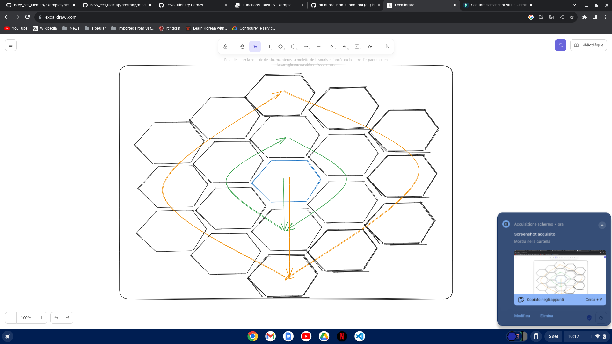

Use a tilemap
Use hexagons
each hexagon has a color rappresenting a state
the state is computed based on some values such as water, biomass, sunlight and vegetation

## Map tiles creation
define the size of the map from x,y --> find middle and spawn hexagons ( of a certain radius) with the method showed in the graph
 
